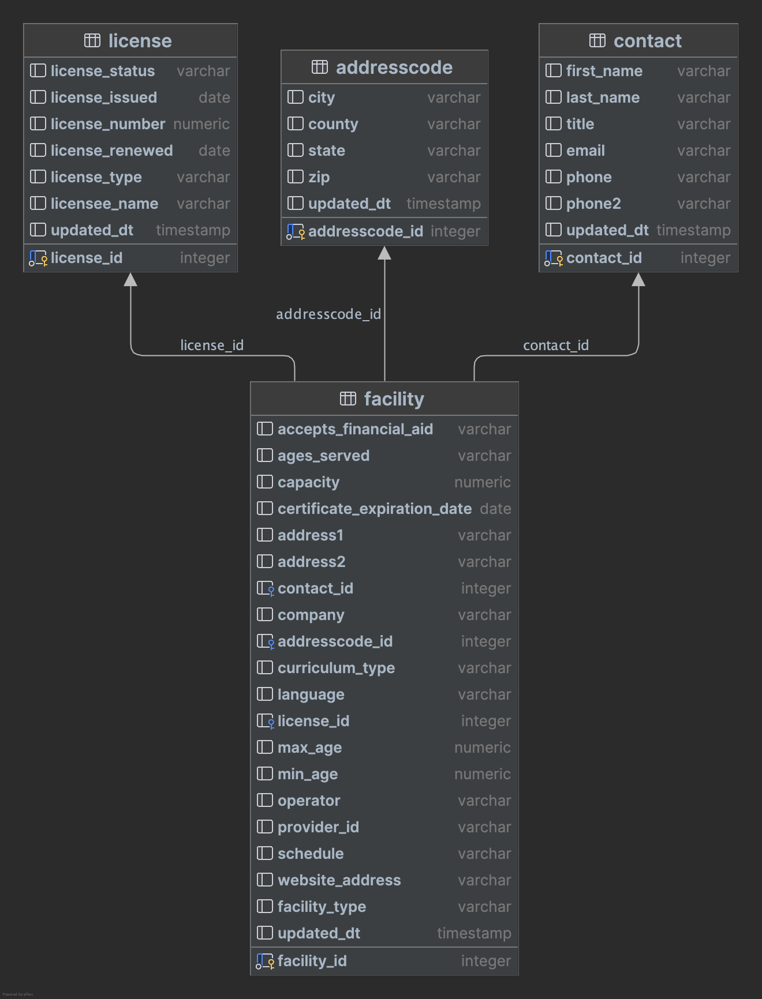

# Brightwheel - Senior Data Engineer Exercise

## Setup Notes
- Install required Python libraries via pip:
  - pip3 install -r requirements.txt
- Setup a PostgreSQL database instance
- Create PostgreSQL credentials (username/password) with proper read/write access
  - TODO: update db_utils.get_db_connection() method
  - This codebase was developed by running a local instance of PostgreSQL in a Docker container

## Running Instructions
- python3 load_input_data.py -p input_files -f source1.csv source2.csv source3.csv

## Implementation Notes
- each source file has it's own method for source-specific processing logic:
  - source1_processor.ingest_source1
  - source2_processor.ingest_source2
  - source3_processor.ingest_source3
- new source files can be processed by implemented a new method, following this pattern
  

## Database Schema
- Target database: PostgreSQL
- 3rd normal form design
- see schema diagram:
  - (schema_diagram.png)

## QA considerations
- staging/test environments should be setup
  - sample datasets for unit/integration testing
  - full-size datasets for performance/stress testing
  
## Data Governance
- consider integrating with 3rd data catalog services for data lineage/discovery
  - AWS Glue

## Infrastructure/Monitoring/Orchestration
- Consider using Airflow or Dagster for scheduling/workflow needs
- After data is processed, include a workflow step in pipeline to run some SQL-based data checks:
  - send alert (Slack, PagerDuty, etc) if any these checks fail:
    - record counts out of expected range
    - missing data
    - data in unexpected format
    - numerical column values outside of a specified range
- consider third-party tools like Monte Carlo for data observability/anomaly detection

## Potential performance improvements
- use pandas library for data tranformations
- dask library for multi-process parallel processing
  - process all source files at same time
- identify columns for partitioning and clustering (for better querying performance)
- consider versioning of the schema to support schema changes
- additional Star/Snowflake schema based-layer based on 3NF schema:
  - faster/simplified queries
  - example:
    - fact_facility
    - dim_addresscode
    - dim_contact
    - dim_license
    
  

## Additional Notes:
- place each pipeline run in a separate dataset, name appended with processing date
  - allows retention of history, re-running of a schedule run
  - if a pipeline run needs to be re-run, the corresponding schema can be deleted before the re-run
    - for example:
      - brightwheel.leads_20251105.addresscode
      - brightwheel.leads_20251105.contact
      - brightwheel.leads_20251105.license
      - brightwheel.leads_20251105.facility
  
